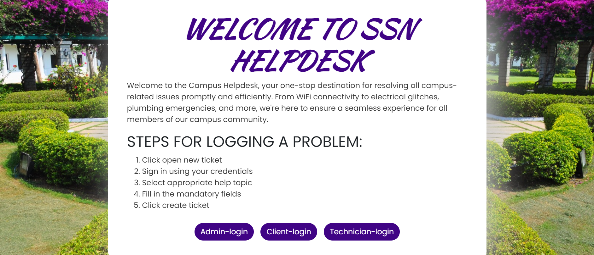
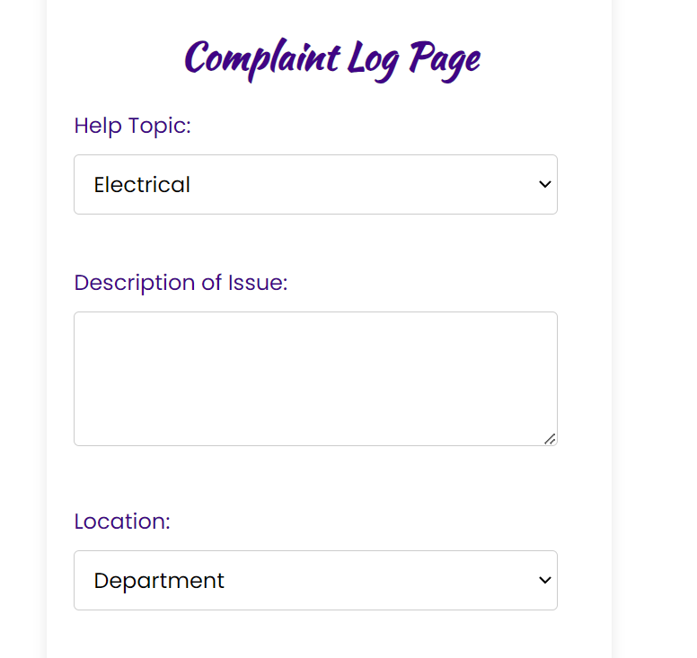
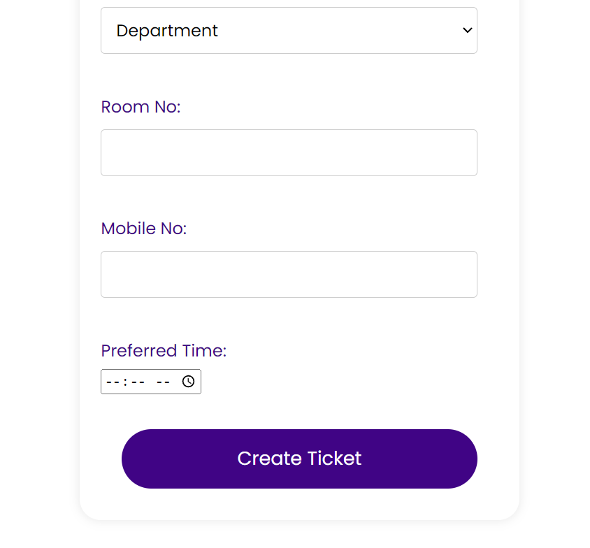
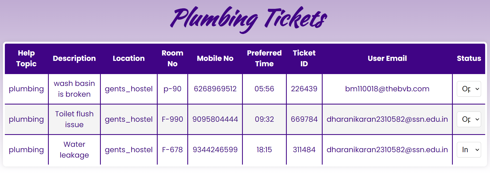
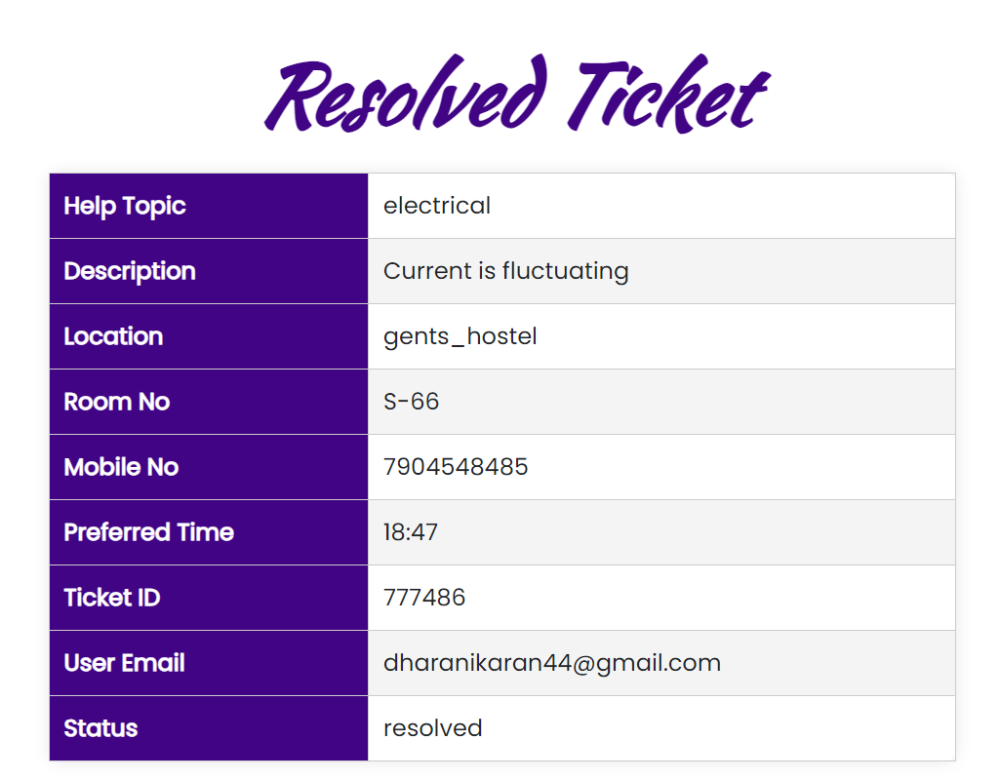
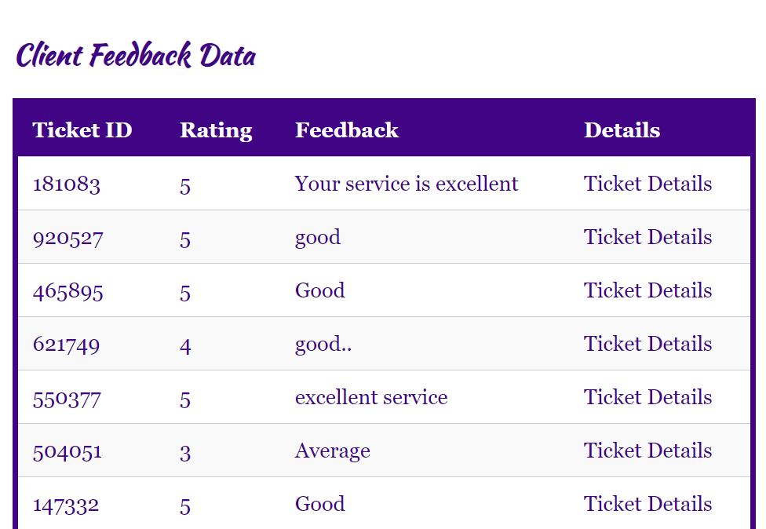

# 🎫 Helpdesk Ticketing System

A simple, efficient Helpdesk Ticketing System built with Flask, HTML/CSS, and JSON. Users can submit tickets, agents can track and resolve issues, and feedback is collected at the end of the process.

---

## 🖼️ Application Screenshots

### 1. Home Page



> The home page introduces the Helpdesk platform, providing access to client and agent portals, along with ticket submission options.

---

### 2. Client Ticket Submission Form

<p align="center">
  
  
</p>

> Clients can enter their issue details, select the category, and submit a new ticket using this form. Input validation and clear layout improve usability.

---

### 3. Agent Ticket Dashboard



> Admins or support agents can view all active tickets, assign statuses (Open, In Progress, Resolved), and manage client issues in real-time.

---

### 4. Resolved Tickets View



> Displays all tickets that have been resolved. Useful for tracking performance and maintaining resolution records for future audits.

---

### 5. Client Feedback Dashboard



> After a ticket is resolved, clients can provide feedback. This dashboard shows all collected feedback for internal review and service improvement.

---

## 🚀 Features

- 📝 Submit helpdesk tickets via web form  
- 📌 Manage and track ticket status  
- 🔁 JSON-based data handling (no SQL setup)  
- 📤 Client feedback system  
- 💻 Clean UI with HTML and CSS  
- ⚙️ Lightweight Flask backend

---

## 🛠️ Tech Stack

| Technology | Description            |
|------------|------------------------|
| Python     | Backend using Flask    |
| HTML/CSS   | Frontend styling       |
| JSON       | Ticket data storage    |

---

## 📦 Installation & Running

```bash
# 1. Clone the repository
https://github.com/DharanikaranS/helpdesk.git
cd helpdesk

#2.Install dependencies
pip install flask

#3.run flask app
python3 flsk.py
```

## 👤 Author

**Dharanikaran S**  
🎓 B.E. Computer Science and Engineering  
🏫 SSN College of Engineering, Tamil Nadu  
📧 dharanikarans27@email.com  
🔗 [LinkedIn](https://www.linkedin.com/in/dharanikaran-s-229b55303/)  
🔗 [GitHub](https://github.com/DharanikaranS)

---

> © 2025 Dharanikaran S. All rights reserved.
